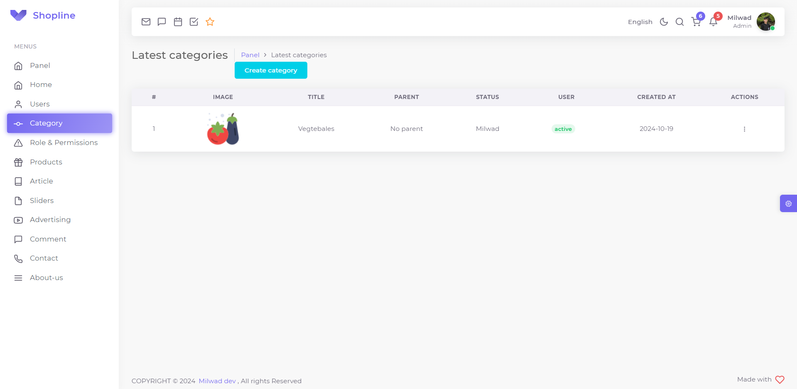

## Introduction

Shopline is a full-stack e-commerce platform developed using Laravel, structured with a modular architecture to ensure scalability, maintainability, and efficient feature development. The platform integrates key features such as user management, product catalog, shopping cart, order processing, and payment gateway integration.

## Key Features
1. User Management:
   - Authentication and authorization for both customers and admin users.
   - Profile management and order history access for registered customers.
2. Product Management:
   - Modular product catalog with categories, attributes, and inventory tracking.
   - Product images, pricing, and discounts.
3. Cart and Checkout:
   - Persistent shopping cart allowing users to add/remove items and adjust quantities.
   - Checkout flow integrated with popular payment gateways.
4. Order Processing and Tracking:
   - End-to-end order management, from placement to fulfillment.
   - Notifications and status updates for customers on their orders.
5. Admin Panel:
   - An organized interface for managing products, orders, users, and site settings.
   - Role-based access for administrative tasks.

## Features 🎉

* Modular architecture
* Custom authentication
* Dynamic menu
* Design Patterns
* SOLID
* Sweetalert
* Toast
* Ajax
* JQuery
* TDD
* [Laravel-Crod](https://github.com/milwad-dev/laravel-crod)
* [Laravel-Validate](https://github.com/milwad-dev/laravel-validate/)
* [Laravel-Attributes](https://github.com/milwad-dev/laravel-attributes)
* Role-Permission system
* Custom Helpers
* Module maker custom command
* Gate & Policy
* Many attributes
* [Spatie Tags](https://github.com/spatie/laravel-tags)
* [Intervention Image](https://github.com/Intervention/image)
* Test coverage
* Laravel Components
* Polymorphic relationships
* [Laravel Pint](https://github.com/laravel/pint)
* [PHPStan (Level 7)](https://github.com/phpstan/phpstan)

## Demos

### Panel Demos

- Category Index


## Run Pint & PHPStan

For convenience, we are define two composer scripts to run `Pint` and `PHPStan`:

```shell
composer pint
composer stan
```

## Contributors
<a href="https://github.com/milwad-dev/shopline/graphs/contributors">
    
</a>

## License
Shopline is an open-source E-Commerce that will always be free under the [MIT License](https://github.com/bagisto/bagisto/blob/master/LICENSE).
